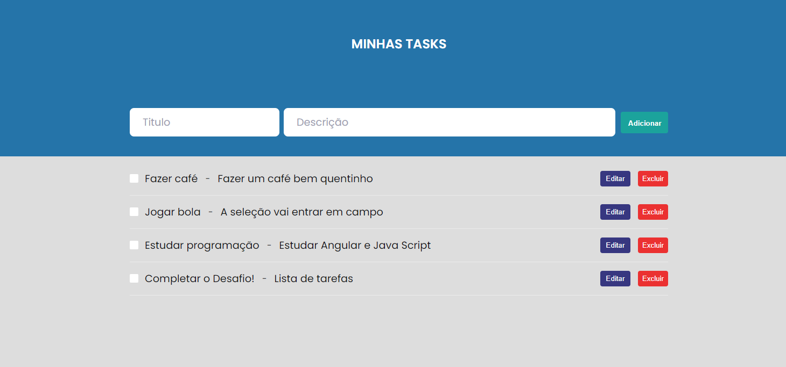

# Lista de tarefas

## Demo

## Techs
* [ ] ReactJs
* [ ] SASS
* [ ] Typescript
* [ ] Json-server

## Install

1. Use o comando: yarn, ou npm install.
2. Para iniciar o servidor, use o comando: yarn server, ou npm run server.
3. Para iniciar a aplicação, use o comando: yarn start, ou npm run start.

## Author

**Wesle Leal**